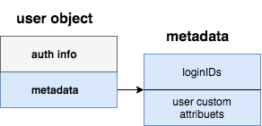

# Description

In skygear v1, auth related API in SDK often returns a `user<Record>` as the result. e.g.

```javascript=
skygear.auth.signupWithUsername(username, password).then((user) => {
  console.log(user); // user is an user record
  console.log(user["username"]); // username of the user
}, (error) => {
  ...
});
```

and user can update its profile via `record` API, like:

```javascript=
var user = skygear.auth.currentUser;
user["username"] = "new-username";
skygear.publicDB.save(user).then((user) => {
  console.log(user); // updated user record
  console.log('Username is changed to: ', user["username"]);
  return skygear.auth.whoami();
}, (error) => {
  console.error(error);
});
```

In this spec, it will describe the structure of user object in skygear next, and how to update user object.

# Glossary

- skygear next: next generation skygear.
- auth gear: skygear next component for user authentication and authorization.
- `LOGIN_ID_METADATA_KEYS`: a list of keys which defines which keys can be used for authentication (previously called `AUTH_RECORD_KEYS` in skygear v1), this list is mainly used for multi-provider login.
- `loginIDs`: a **flattened** dictionary which use `LOGIN_ID_METADATA_KEYS` as a key and its associated values.
- auth info: any data that may affect or affected by user authentication status or authorized status, such as disabled, last login at, roles, ..., etc.
- user custom attributes: any user attributes that are not auth info related.
- metadata: a dictionary combines `loginIDs` and user custom attributes.
- user object: an object combines auth info and metadata that represents an user.

# User object overview

Following is a illustration of a user object's structure.



```
{
    user_id: <id>,
    created_at: <created_at>,
    updated_at: <updated_at>,
    last_seen_at: <last_seen_at>,
    verified: <verified>,
    verify_info: <verified_info>,
    roles: [<role>, <role>, <role>, ...],
    metadata: {
      // loginIDs
      username: <username>,
      email: <email>,
      // custom user attributes
      avatar_url: <avatarUrl>,
      name: <name>,
      nickname: <nickname>,
      birthday: <birthday>,
      preferred_lang: <preferred_lang>,
    }
}
```

Note that, `metadata` in user object is a merged dictionary from two dictionaries, the two dictionaries are `loginIDs` and user custom attributes.

# `LOGIN_ID_METADATA_KEYS` and `loginIDs`

`LOGIN_ID_METADATA_KEYS` is a list of a list of keys, which defines which keys can be used for user authentication. Default `LOGIN_ID_METADATA_KEYS` is `[['username'], ['email']]`. `LOGIN_ID_METADATA_KEYS` is a global config for an app, it can be configured via `skycli`.

Each item in `LOGIN_ID_METADATA_KEYS` defines a set of values for user authentication, for example, `[['username'], ['email']]` indicates that a user can be authicated by username or email.

Take `[['username'], ['email'], ['username', 'email'], ['nickname', 'role']]` as another example, here, user can be authicated by

- `username`
- `email`
- `username` and `email`
- `nickname` and `role`

any one of them works.

`loginIDs` is a **flattened** dictionary which contains `LOGIN_ID_METADATA_KEYS` and its associated values, for example:

```json
// `LOGIN_ID_METADATA_KEYS` = [["username"], ["email"]]
{
  "username": "example",
  "email": "example@example.com"
}
```

or

```json
// `LOGIN_ID_METADATA_KEYS` = [["username"], ["email"], ["nickname", "business_email"]]
{
  "username": "example",
  "email": "example@example.com",
  "nickname": "john.doe",
  "busniess_email": "john.doe@example.com"
}
```

# `updateMetadata` and `loginIDs`

`updateMetadata` is a newly added API for user to update its metadata, due to user object's `metadata` object contains both user custom attributes and `loginIDs`, so any changes from `updateMetadata` may directly impact user authentication behavior.

- Modify: if a value of `loginIDs` updated, a user's login ID is also updated. 
- Add: if a value associated to `LOGIN_ID_METADATA_KEYS` added, a user implicitly add a new login ID.
- Remove: if a value assciated to `LOGIN_ID_METADATA_KEYs` removed, a connected user login ID is removed as well.

## Example scenario:

Scenario Info: 

- `LOGIN_ID_METADATA_KEYS = [['username'], ['email'], ['nickname', 'business_email']]`
- user's existing login ID:
  - `username` = "example"
  - `password` = "password" 
- user object's `metadata` is
  ```javascript
  {
    // loginIDs:
    "username": "example",
    // user custom attributes:
    "gender": "none"
  }
  ```

Case 1: Modify

```javascript
const currentUser = skygear.auth.currentUser;
currentUser['metadata']['username'] = 'new_example';
skygear.auth.updateMetadata(currentUser);
// user has to use "new_example"(username) + "password"(password) to login next time
```

Case 2: Add

```javascript
const currentUser = skygear.auth.currentUser;
currentUser['metadata']['email'] = 'example@example.com';
skygear.auth.updateMetadata(currentUser);
// user has following two login IDs:
// - "new_example"(username) + "password"(password)
// - "example@example.com"(email) + "password"(password)

currentUser['metadata']['nickname'] = 'john.doe';
skygear.auth.updateMetadata(currentUser);
// user has following two login IDs:
// - "new_example"(email) + "password"(password)
// - "example@example.com"(username) + "password"(password)
// user object's metadata is
// {
//   //------ `loginIDs`:
//   "username": "new_example",
//   "email": "example@example.com",
//   //------ user custom attributes:
//   "nickname": "john.doe",
//   "gender": "none"
// }

currentUser['metadata']['business_email'] = 'john.doe@example.com';
skygear.auth.updateMetadata(currentUser);
// user has following three login IDs, because business_email added:
// - "new_example"(username) + "password"(password)
// - "example@example.com"(email) + "password"(password)
// - "john.doe"(nickname) + "john.doe@example.com"(nickname) + "password"(password)
// user object's metadata is
// {
//   //------ `loginIDs`:
//   "username": "new_example",
//   "email": "example@example.com",
//   "nickname": "john.doe",
//   "business_email": "john.doe@example.com",
//   //------ user custom attributes:
//   "gender": "none"
// }
```

Case 3: Remove

```javascript
const currentUser = skygear.auth.currentUser;
delete currentUser['metadata']['username'];
skygear.auth.updateMetadata(currentUser);
// user has following two login IDs:
// - "example@example.com"(email) + "password"(password)
// - "john.doe"(nickname) + "john.doe@example.com"(nickname) + "password"(password)
// user object's metadata is
// {
//   //------ `loginIDs`:
//   "email": "example@example.com",
//   "nickname": "john.doe",
//   "business_email": "john.doe@example.com",
//   //------ user custom attributes:
//   "gender": "none"
// }
```

# `updateMetadata` and user custom attributes

`updateMetadata` also supports to update user's custom attributes, any data in `metadata` does not belong to `loginIDs` is saved properly when the user invokes `updateMetadata`.

# Changes on Client JS SDK

Because user object is not a `record` object anymore, client SDK has to treat user object as a plain object, and a user can access user attributes via regular way.

In skygear v1 JS SDK, `container`'s `UserRecord` is defined as

```
export const UserRecord = Record.extend('user');
```

Since `Record` is removed, `UserRecord` in APIs should be replaced as `User` class (a simple plain JavaScript class), they are:

```
- currentUser: User
- async changePassword(oldPassword: String, newPassword: String, invalidate: Boolean): Promise<User>
- async fetchUserRole(users: User[] | String[]): Promise<Object>
- async login(loginIDs: Object, password: String): Promise<User>
- async loginWithEmail(email: String, password: String): Promise<User>
- async loginWithProvider(provider: String, loginIDs: Object): Promise<User>
- async loginWithUsername(username: String, password: String): Promise<User>
- async signup(loginIDs: Object, password: String, data: Object): Promise<User>
- async signupAnonymously(): Promise<User>
- async signupWithEmail(email: String, password: String, data: Object): Promise<User>
- async signupWithUsername(username: String, password: String, data: Object): Promise<User>
- async whoami(): Promise<User>
```

## New API on Client JS SDK

- `Promise<User> updateMetadata(<User>);`  
  use for updating a user's metadata.

## Removal APIs on Client JS SDK

Due to the removal of record gear, auth gear and client SDK won't provide below functionalities:

1. user query
2. admin related API (disable user, change role, ...)

And so below APIs are removed from client SDK:

| API | RESTful API |
| ------------- |:-------------:|
| `adminDisableUser` | `/auth/disable/set` |
| `adminEnableUser` | `/auth/disable/set` |
| `adminResetPassword` | `/auth/reset_password` |
| `assignUserRole` | `/auth/role/assign` |
| `revokeUserRole` | `/auth/role/revoke` |
| `setDefaultRole` | `/auth/role/default` |
| `setAdminRole` | `/auth/role/admin` |

Those requirements can be implemented via cloud function or external user DB.

## API argument naming chages on Client JS SDK:

- `public async requestVerification(recordKey: String): Promise`  
  `public async requestVerification(loginIDKeys: [String]): Promise`
- `async login(authData: Object, password: String): Promise<Record>`  
  `async login(loginIDs: Object, password: String): Promise<User>`
- `async loginWithProvider(provider: String, authData: Object): Promise<Record>`  
  `async loginWithProvider(provider: String, loginIDs: Object): Promise<User>`
- `async signup(authData: Object, password: String, data: Object): Promise<Record>`  
  `async signup(loginIDs: Object, password: String, data: Object): Promise<User>`

# Changes on auth gear

auth gear will support a new interface `/auth/me/update_metadata`, the following is a demonstration usage:

```
curl -X POST -H "Content-Type: application/json" \
     -d @- http://<skygear>/auth/me/update_metadata <<EOF
{
  "email": "example@example.com",
  "nickname": "john.doe",
  "business_email": "john.doe@example.com",
  "gender": "none"
}
```

auth gear also needs to update `AuthResponse`:

Old:

```go=
type AuthResponse struct {
	UserID      string                  `json:"user_id,omitempty"`
	Profile     userprofile.UserProfile `json:"profile"`
	Roles       []string                `json:"roles,omitempty"`
	AccessToken string                  `json:"access_token,omitempty"`
	LastLoginAt *time.Time              `json:"last_login_at,omitempty"`
	LastSeenAt  *time.Time              `json:"last_seen_at,omitempty"`
	Verified    bool                    `json:"verified"`
	VerifyInfo  map[string]bool         `json:"verify_info"`
}
```

New:

```go=
type AuthResponse struct {
	UserID      string                   `json:"user_id,omitempty"`
	Metadata    userprofile.UserMetadata `json:"metadata"`
	Roles       []string                 `json:"roles,omitempty"`
	AccessToken string                   `json:"access_token,omitempty"`
	CreatedAt   *time.Time               `json:"created_at,omitempty"`
	UpdatedAt   *time.Time               `json:"updated_at,omitempty"`
	LastLoginAt *time.Time               `json:"last_login_at,omitempty"`
	LastSeenAt  *time.Time               `json:"last_seen_at,omitempty"`
	Verified    bool                     `json:"verified"`
	VerifyInfo  map[string]bool          `json:"verify_info"`
}
```

`Metadata` is a JSON object which contains `loginIDs` and user custom attributes.