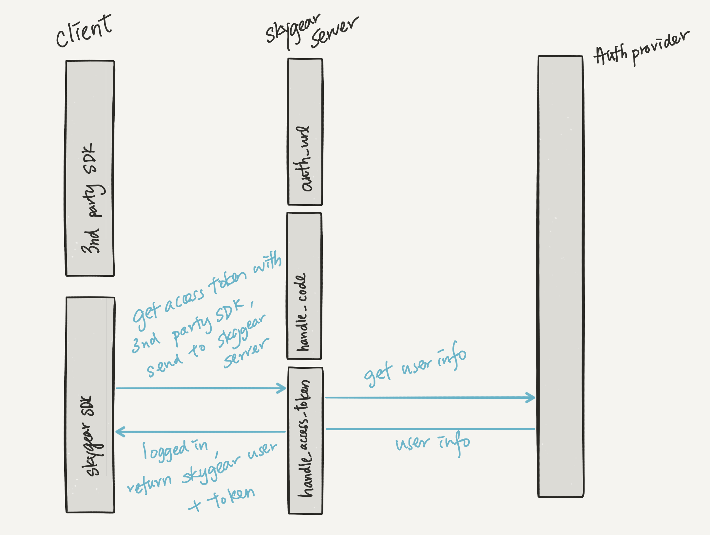
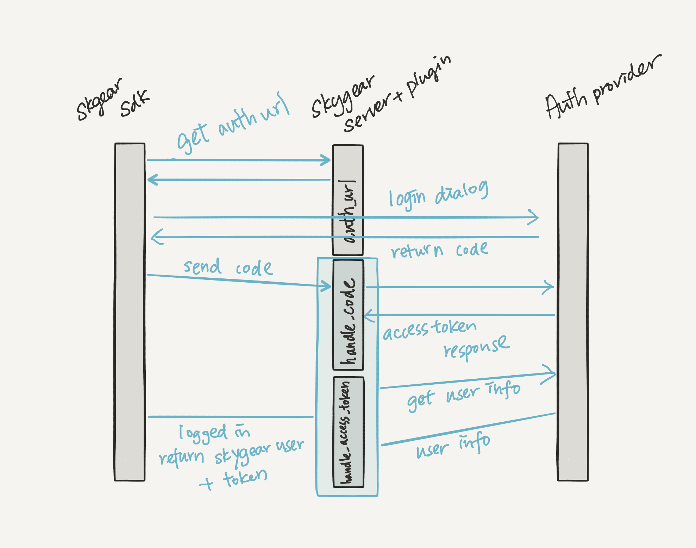

# API Design Overview

Have official plugins for common SSO support; And also make it easy to enable
and config them from Skygear Portal.

Portal needs to have an interface for on/off and configuration of ID / Secret.

## Scenario

* Sign up and login with web popup
* Sign up and login with web redirect
* Sign up and login with limited capability devices (TV/Command line)
* Sign up and login with Mobile
* Sign in, and then interact with 3rd party service using the auth information
* Login by `AuthProvider A`, but the email already got another account from
  `AuthProvider B`, show an error and tell users to login with another
  `AuthProvide B`
* Login by `AuthProvider A`, but the email already got another account from
  `AuthProvider B`, tell users to login and link with new AuthProvider
* Login by `AuthProvider A`, but the email already got another account from
  `AuthProvider B`, assume it is two different accounts (will break the
  assumption of Skygear, which each users got unique email address)
* At User Setting page, add another `AuthProvider`
* Integrate with any service that supports OAuth by writing cloud code.

## Duplicate email handling

To handle case when user login by `AuthProvider A`, but the email already
got another account from `AuthProvider B`

* Scenario A: Return error, client can show error in application code
* Scenario B: Logged in user to `AuthProvider B` account
* Scenario C: Create new account for `AuthProvider A`

**Suggested Implementation:**

Provide option `AUTO_LINK_PROVIDER_KEYS`, same format as `AUTH_RECORD_KEYS`
default is `email`. Can only set `email` or empty in portal.

* `AUTO_LINK_PROVIDER_KEYS` is `email` => Scenario B
* `AUTO_LINK_PROVIDER_KEYS` is empty, default behavior => Scenario A
* `AUTO_LINK_PROVIDER_KEYS` is empty, remove email from `AUTH_RECORD_KEYS` or
  remove email by `sso_process_profile_response` => Scenario C

As Scenario C is not a normal flow, so need adding code for customization

# Changes on SDK

## JS
All function are under `skygear.auth`

- `loginOAuthProviderWithPopup(providerID, options)` and `loginOAuthProviderWithRedirect(providerID, options)`
  - Create or login a new skygear user, associated with the provider
  - `providerID` - A string that identify the login provider
  - `options`
    - scope - Override scope if set in portal
    - redirectUri - The URL that skygear will redirect after authorization flow.
  - This function returns a skygear user, and an access token of the service.

```js
  skygear.auth.loginOAuthProviderWithPopup('com.facebook', {
    scope: []
  }).then(function(skygearUser) {

  }).catch(function(error) {

  });

  skygear.auth.loginOAuthProviderWithRedirect('com.facebook', {
    scope: [],
    redirectUri: 'https://app.example.com/signup'
  });

  skygear.auth.getLoginRedirectResult().then(function(skygearUser) {

  }).catch(function(error) {

  });
```

- `linkProviderWithPopup(providerID, options)` and `linkProviderWithRedirect(providerID, options)`
  - Add a new auth provider to the user by going through the auth flow
  - This API requires user to be logged in already, return error otherwise
  - `providerID` - A string that identify the login provider
  - `options`
    - scope
    - redirectUri - The URL that skygear will redirect after authorization flow.
  - This function returns a skygear user, and an access token of the new
    service.

```js
  skygear.auth.linkOAuthProviderWithPopup('com.facebook', {
    scope: []
  }).then(function(skygearUser) {

  }).catch(function(error) {

  });

  skygear.auth.linkOAuthProviderWithRedirect('com.facebook', {
    scope: [],
    redirectUri: 'https://app.example.com/signup'
  });

  skygear.auth.getLinkRedirectResult().then(function(skygearUser) {

  }).catch(function(error) {

  });
```

- `unlinkOAuthProvider(providerID)`

```js
  skygear.auth.unlinkOAuthProvider.then(function() {

  }).catch(function(error) {

  });
```

- `getOAuthTokens(providerID)`
  - Calls skygear-server `user:oauth_tokens`, `user:set_oauth_token`
  - Return a promise of authResult

```js
  skygear.auth.getOAuthTokens('com.example').then(function(authResult) {
    /*
    {
      "access_token": "...",
      "token_type": "bearer",
      "expires_at": 1495052619,
      "scope": ["email", "friends"],
      "refresh_token": "...."
    }
    */
  });
```

### Platform specific API
- `loginWithFacebook(options)` and `loginWithGoogle(options)`
  - `options`
    - uxMode - Either `popup`(default), or `redirect`
    - scope
    - redirectUrl - when uxMode is `redirect`, skygear will redirect the user
      to this url after auth. If it is null, back to the current URL
    - use3rdPartyClient - whether to use 3rd party client, e.g. Facebook JS
      SDK. Default `false`

## iOS

- `-[SKYContainer.auth loginWithOAuthProvider:(NSString*)providerID,
  options:(NSDictionary*)options completion:(void(^)(NSError*, SKYUser*))]`
  - Create or login a new skygear user, associated with the provider
  - `providerID` - A string that identify the login provider
    - We will provide `com.facebook`, `com.google`
  - `options`
    - uxMode - Either `popup`(default), or `redirect`, popup means
      in-app-browser (SFSafariViewController/WKWebView) and redirect means
      Safari.app
    - scope
  - This function returns a skygear user, and an access token of the service,
    via a delegate.
- `-[SKYContainer.auth loginWithOAuthProvider:(NSString*)providerID,
  accessToken:(NSString*)accessToken completion:(void(^)(NSError*,
  SKYUser*))]`
  - `accessToken` - Client calls this API if it already has an access token,
    skygear will try to login directly instead of going through the OAuth
    flow.
- `-[SKYContainer.auth linkWithOAuthProvider:(NSString*)providerID
  options:(NSDictionary*)options completion:(void(^)(NSError*, SKYUser*))]`
  - Add a new auth provider to the user by going through the auth flow
  - `providerID` - A string that identify the login provider
  - `options`
    - scope
  - This function returns a skygear user, and an access token of the new
    service, via delegate.
- `-[SKYContainer.auth unlinkWithOAuthProvider:(NSString*)providerID completion:(void(^)(NSError*, SKYUser*))]`
- `-[SKYContainer.auth getOAuthTokensWithCompletion:(void(^)(NSError*,
  NSDictionary*))]`
  - Return all AuthResult

        [container.auth getOAuthTokensWithCompletion:^(NSDictionary *authResult){
        //tokens['com.facebook'] is FB's access token }];

- `-[SKYContainer.auth getOAuthTokenWithOAuthProvider:(NSString*)providerID,
  completion:(void(^)(NSError*, NSDictionary*))]`


### Platform specific APIs

- `-[SKYContainer.auth loginWithFacebook:(NSDictionary*)options]` and `-[SKYContainer loginWithGoogle:(NSDictionary*)options]`
  - `options`
    - scope
    - version - FB Client SDK only
    - cookiePolicy - Google Client SDK only
    - use3rdPartyClient - whether to use 3rd party client, e.g. Facebook iOS SDK. Default `false`
  - Returns the user logged in via delegate.

## Android

- `container.auth().loginWithOAuthProvider(providerID, options, new
  OAuthResponseHandler())`
- `container.auth().linkWithOAuthProvider(providerID, options, new
  OAuthResponseHandler())`
- `container.auth().unlinkWithOAuthProvider(providerID, new
  OAuthResponseHandler())`
- `container.auth().getOAuthToken(providerID, new
  OAuthResponseHandler())`

OAuthResponseHandler Interface

```
OAuthResponseHandler.onAuthFails(Error error);
OAuthResponseHandler.onAuthSuccess(SKYUser user);
```

# Changes on API at skygear-server

- New lambda `user:oauth_tokens`
  - Return OAuth data from database, the `_user.auth` column

- New lambda `user:set_oauth_token`
  - Take a provider id, and OAuth data
  - Save data into `_user.auth`, with "oauth." prefix in OAuth data

# Changes on Portal

Add SSO section, for each predefined provider:
- checkbox for `SSO_{PROVIDER}_ENABLED`
- input field for `SSO_{PROVIDER}_CLIENT_ID`
- input field for `SSO_{PROVIDER}_CLIENT_SECRET`
- input field for `SSO_{PROVIDER}_SCOPE`
    - comma separated
    - Could be checkbox list based on provider, for example:
        - facebook: email, public_profile, user_likes ...
        - google: https://www.googleapis.com/auth/userinfo.email, https://www.googleapis.com/auth/userinfo.profile ...

# Changes on Plugin

## Environment variables

- `AUTO_LINK_PROVIDER`, boolean
- `SSO_{PROVIDER}_ENABLED`
- `SSO_{PROVIDER}_CLIENT_ID`
- `SSO_{PROVIDER}_CLIENT_SECRET`
- `SSO_{PROVIDER}_SCOPE`

## Implementation

### Pseudo code of AuthProvider

``` python
@skygear.provides("oauth", "com.google")
class GoogleOAuthProvider(BaseOAuthProvider)
    name = 'google' # use to parse envvar and route

    @property
    def auth_base_url(self):
      return "https://accounts.google.com/o/oauth2/v2/auth"

    def auth_url(self, request): # Implement for customization
      return self.auth_base_url + "?" +
          "response_type=code&" +
          "client_id=" + self.client_id + "&"
          "redirect_uri={redirect_uri}&" +
          "access_type=offline&prompt=select_account"

    @property
    def access_token_base_url(self):
      return "https://www.googleapis.com/oauth2/v4/token"

    def refresh_token_base_url(self):
      return "https://www.googleapis.com/oauth2/v4/token"

    """
    we need this for creating skygear user
    """
    def user_info_url(self):
      return "https://www.googleapis.com/oauth2/v1/userinfo"

    """
    limited capability devices support
    """
    @property
    def device_code_base_url(self):
      return "https://accounts.google.com/o/oauth2/device/code"

    """
    limited capability devices support
    """
    @property
    def poll_access_token_base_url(self):
      return "https://www.googleapis.com/oauth2/v4/token"


class BaseOAuthProvider:
    name = 'SSO' # use to parse envvar and route
    client_id = None
    client_secret = None
    scope = []

    def __init__(self, profile_response_customizer=None,
                 duplicate_user_handler=None):
        env_name = self.name.upper()
        self.client_id = os.environ.get(env_name + '_CLIENT_ID', None)
        self.client_secret = os.environ.get(env_name + '_CLIENT_SECRET', None)
        self.scope = os.environ.get(env_name + '_SCOPE', '').split(',')
        self.profile_response_customizer = profile_response_customizer

    @property
    def auth_base_url(self):
        raise NotImplementedError('Missing auth base url')

    def auth_url(self, request):
        # get `redirect_uri` from request which provided by client
        # The URL that skygear will redirect after authorization flow
        return self.auth_base_url + "?" +
            "response_type=code&" +
            "client_id=" + self.client_id + "&"
            "redirect_uri=" + generate_redirect_url(redirect_uri) + "&" +
            "access_type=offline&prompt=select_account"

    @property
    def access_token_base_url(self):
        raise NotImplementedError('Missing access token base url')

    def access_token_url(self, code, redirect_uri):
        return self.access_token_base_url + "?" +
            "client_id=your_client_id&" +
            "client_secret=your_client_secret&" +
            "code=" + code + "&" +
            "grant_type=authorization_code"

    @property
    def refresh_token_base_url(self):
        raise NotImplementedError('Missing refresh token base url')

    def refresh_token_url(self, refresh_token):
        return self.refresh_token_base_url() + "?" +
            "grant_type=refresh_token&refresh_token=" + refresh_token

    def user_info_url(self):
        raise NotImplementedError('Missing user info url')

    @property
    def device_code_base_url(self):
        raise NotImplementedError('Missing device code url')

    def device_code_url(self):
        raise NotImplementedError('Missing device code url')

    @property
    def poll_access_token_base_url(self):
        raise NotImplementedError('Missing poll access token url')

    def poll_access_token_url(self):
        raise NotImplementedError('Missing poll access token url')

    def generate_redirect_url(self, redirect_uri):
        return "https://{app}.skygeario.com/sso/{provider}/callback?redirect_uri={redirect_uri}"

    def callback(self, request):
        access_token_url = self.access_token_url(request.get('code'))

        """
          call access_token_url to request access_token
        """
        response = requests.POST(access_token_url)
        ....

        access_token_data = self.process_access_token_response(
            response.json_body)

        user = self.handle_access_token(access_token_data)
        # redirect to uri from generate_redirect_url
        return

    def handle_access_token(self, request):
        user = self.handle_access_token(access_token_data)
        return

    def signup_user_with_access_token(self, access_token_data):
        existing_user = get_user_by_access_token(access_token_data)
        if existing_user:
          return existing_user

        # get user profile from 3rd party
        user_info_url = self.user_info_url()
        url, headers, data = self.process_protected_request(
          user_info_url, auth_header, data
        )
        profile_response = requests.get(
          user_info_url, headers=auth_header, data=data).json_body

        if self.profile_response_customizer:
            profile_response = self.profile_response_customizer(
                profile_response
            )

        user = get_auto_link_user(AUTO_LINK_PROVIDER_KEYS, profile_response)
        if user is not None:
            add_auth_to_user(user, token)
            return user

        try:
            user = create_new_user(profile_response)
        except DuplicateUserError as err:
            raise Exception()

        return user

    def register(self, name):
        skygear.handler('sso/'+ self.name +'/auth_url', self.auth_url)
        skygear.handler('sso/'+ self.name +'/callback', self.callback) # auth dialog callback
        skygear.handler('sso/'+ self.name +'/handle_access_token', self.handle_access_token) # login with 3rd party SDK

    """
    hock for customizations
    """
    def process_access_token_response(self, response_data):
        return response_data

    def process_refresh_token_response(self, response_data):
        return response_data

    def process_protected_request(self, url, headers, data):
        return url, headers, data

```

**Sign in with limited capability devices flow**

Refs: [
OAuth 2.0 for TV and Limited-Input Device Applications](https://accounts.google.com/o/oauth2/device/code)

**Need providing hook to allow customizations for non compliant providers**

Refs: [requests-oauthlib](https://github.com/requests/requests-oauthlib)

- access_token_response
- refresh_token_response
- protected_request

### Customization

```py
@sso_process_profile_response('com.facebook')
def handle_facebook_profile_response(response):
    return {
      'username': response.get('username'),
      'email': response.get('email'),
      'firstname': response.get('first_name'),
      'lastname': response.get('last_name')
    }

@sso_process_profile_response('com.google')
def handle_google_profile_response(response):
    return {
      'username': response.get('username'),
      'email': response.get('email'),
      'firstname': response.get('given_name'),
      'lastname': response.get('family_name')
    }
```

## APIs

### APIs for auth flow

- New lambda `sso/{provider}/auth_url`
  - Accepts a provider id and options
  - Return an url for auth
  - Example pseudo return value

        https://www.facebook.com/v2.9/dialog/oauth?
        client_id={app-id}
        &redirect_uri=http%3A%2F%2Fskygear.dev%2Foauth%2Fhandle_code%3Fprovider%3Dcom.facebook%26user_id%3D123

- New lambda `sso/{provider}/callback`
  - A handler that accepts code from 3rd party service
  - Exchange code with access token
  - Create user if needed
  - Add access token to user `user:set_oauth_token`
  - Pass the user back to client
  - An pseudo example of the url that is expect to be called

        http://skygear.dev/oauth/handle_code?provider=com.facebook&user_id=123&code=223344

- New lambda `sso/{provider}/handle_access_token`
  - Accepts a provider id, and access token
  - If this handler is called with a user logged in
    - Associate the user with auth provider and access token
  - Otherwise,
    - Login or create new users according to the provider and access token
    - Add access token to user `user:set_oauth_token`
  - Return the user

### API for integrating other services

- New decorator `@skygear.provides("oauth", <provider id>)`
  - Register a new class that returns URLs for OAuth flow
  - Example in the above session
  - The goal is to let users to integrate any website that support OAuth

### Functions for working with 3rd party services after auth

- New method `container.getOAuthTokens()`
  - Return a dictionary of OAuth tokens of the current user
  - Call `skygear-server` `user:oauth_tokens` `user:set_oauth_token`
  - Pseudo code

        container.getOAuthTokens('com.facebook').access_token

- New method `container.refreshToken(providerID)`
  - A convenient method that refreshs access_token if needed, and if possible.
  - Updates database after refresh
  - Returns the new token

# Database Scheme

No changes.
Since we are going to use the existing auth provider to handle auth data, I
expect those related data to be saved in `_user` table's `auth` column. There
is no specific format for the data.

I am proposing the following format for data in the auth column.

- Data from OAuth providers will be saved with a "oauth." prefix in id
- The data inside will be almost the same as the [OAuth Access Token Response](https://tools.ietf.org/html/rfc6749#section-4.2.2), e.g.
  - `access_token`
  - `token_type`
  - `expires_at`, calculated from `expires_in`, an absolute timestamp
  - `refresh_token`

```
      {
        "oauth.com.facebook": {
          "access_token": "...",
          "token_type": "bearer",
          "expires_at": 1495052619,
          "refresh_token": "...."
        }
      }
```

# Others Supplement Information

## Login flow

JS, iOS and Android should follow this flow:

### When using 3rd party client

1. Call 3rd party client
2. When user is authed, get the access_token
3. Pass access_token to `oauth:handle_access_token`, to receive skygear user
  - Plugin behaviour depends on `UNIQUE_EMAIL_FOR_ACCOUNTS`
4. Return user and access_token



#### When using OAuth flow

1. Ask for a url to display via `sso/{provider}/auth_url`
2. Show the url to user, either popup or redirect
3. After user login, the webpage should be redirected to plugin with a code
4. Plugin exchanges access token with code (`sso/{provider}/callback`)
  - Behaviour depends on `UNIQUE_EMAIL_FOR_ACCOUNTS`
5. Plugin creates or logins a user
6. Pass the user back to client side



### For devices with limited capability

1. Fetch code and URL from Google / Facebook
2. Return the above data to the developer, expect the URL and should to be shown to user
3. Constantly poll Google / Facebook for auth result
  - With timeout
4. When access_token is received via polling, send it to skygear-server `sso/{provider}/handle_access_token`
  - Plugin behaviour depends on `UNIQUE_EMAIL_FOR_ACCOUNTS`
5. Pass the user from skygear user and `access_token` back to user
